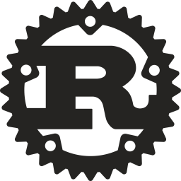

# Rust Commands

## rustc 

verificar a versão:

> **rustc** --version
   
## rustup

atualizar versao do rust:
    
> **rustup** update

## cargo

compile seu projeto:
    
> **cargo** build

execute seu projeto com:

> **cargo** run

teste seu projeto com:
    
> **cargo** test

gere a documentação do seu projeto: 

> **cargo** doc

publique sua biblioteca em crates.io:
    
> **cargo** publish

verificar versao:
    
> **cargo** --version

Novo projeto: 
    
> **cargo** new < project-name > 
    
Gera o "Cargo.toml" que é o manifesto 
de um projeto Rust. Onde você encontra todos os metadados do projeto, assim como as declarações de dependência, e também, src/main.rs é onde 
nos vamos escrever nossa aplicação.

